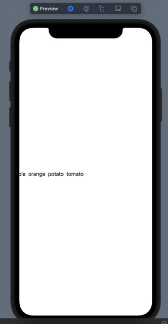

#  Horizontal Lists in SwiftUI (iOS Development)
Describes how to make horizontal lists with notes taken from the awesome design course module 2
lesson 6 at https://learn.codewithchris.com/courses/take/design/lessons/26070218-lesson-6-horizontal-lists.

# TabView Method
Horizontal list using tabs, which creates the dots at the bottom:
```
struct ContentView: View {
    
    var items = ["apple", "orange", "potato", "tomato"]
    
    var body: some View {
        
        TabView {
            ForEach(items, id: \.self) { item in
                Text(item)
                
            }
        }
        .tabViewStyle(.page)
        .indexViewStyle(.page(backgroundDisplayMode: .always))
    }
}
```


# LazyHGrid Method
Specify a single row with the `LazyHGrid`, which will create a horizontal list.
```
// MARK: - LazyHGrid Style
let row = GridItem(.fixed(50), spacing: 5, alignment: .center)
ScrollView(.horizontal) {
    LazyHGrid(rows: [row]) {
        ForEach(items, id: \.self) { item in
            Text(item)
        }
    }
}
```


